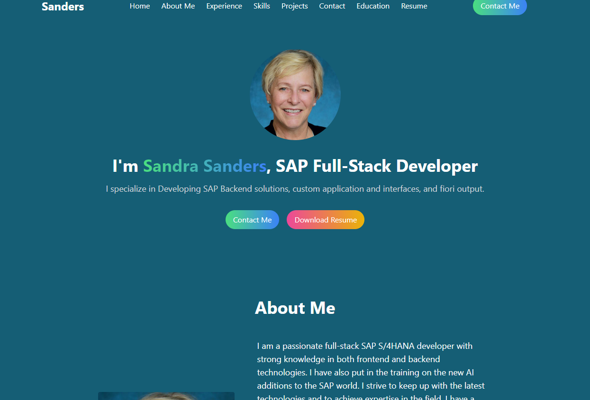

# Personal Portfolio Website using React + Tailwind CSS

https://portfolio-react-tailwind-sdsanders67.replit.app/

 built with the help of a youtube tutorial by Yousaf Khan

 Description

 This portfolio was built for 2 reasons one to teach me the new way of making a react app and to learn tailwindcss. I also needed an updated portfolio.

 Table of Contents

 Installation

 Usage

 license

 Contributing

 Test

 Questions

 Installation
  Clone the repo, then do "npm i" . your run commands are npm run dev. Look at the scripts for more information.

 Usage
 This is the top of the page
  

